# Workflow: Verificación de Usuario y FastFill

Este documento describe el flujo completo de verificación de identidad usando el Jumio Mock Server, desde la implementación en el backend hasta la integración en el frontend.

---

## 📋 Prerequisitos

- Jumio Mock Server corriendo en `http://localhost:3000`
- Credenciales configuradas en `.env`:
  - `MOCK_CLIENT_ID=your-client-id`
  - `MOCK_CLIENT_SECRET=your-client-secret`

---

## 🔄 Flujo Completo

```mermaid
sequenceDiagram
    participant Frontend
    participant Backend
    participant JumioMock
    participant User

    Frontend->>Backend: 1. Solicitar verificación
    Backend->>JumioMock: 2. POST /oauth2/token
    JumioMock-->>Backend: 3. access_token
    Backend->>JumioMock: 4. POST /api/v1/accounts
    JumioMock-->>Backend: 5. workflow URL + SDK token
    Backend-->>Frontend: 6. Retornar workflow URL
    Frontend->>User: 7. Abrir interfaz (iframe/redirect)
    User->>JumioMock: 8. Completar verificación
    JumioMock-->>Backend: 9. Callback (opcional)
    Frontend->>Backend: 10. Solicitar resultados
    Backend->>JumioMock: 11. GET /workflow-executions
    JumioMock-->>Backend: 12. Datos FastFill
    Backend-->>Frontend: 13. Retornar datos del usuario
```



---

## 🔧 Paso 1: Implementación Backend

### 1.1 Crear Servicio de Jumio

Crea un servicio para manejar la comunicación con Jumio:

```typescript
// services/jumioService.ts
import axios from "axios";

const JUMIO_BASE_URL = process.env.JUMIO_BASE_URL || "http://localhost:3000";
const CLIENT_ID = process.env.MOCK_CLIENT_ID || "your-client-id";
const CLIENT_SECRET = process.env.MOCK_CLIENT_SECRET || "your-client-secret";

export class JumioService {
  private accessToken: string | null = null;
  private tokenExpiry: number = 0;

  // Obtener token OAuth2
  async getAccessToken(): Promise<string> {
    // Reusar token si no ha expirado
    if (this.accessToken && Date.now() < this.tokenExpiry) {
      return this.accessToken;
    }

    const credentials = Buffer.from(`${CLIENT_ID}:${CLIENT_SECRET}`).toString(
      "base64"
    );

    const response = await axios.post(
      `${JUMIO_BASE_URL}/oauth2/token`,
      "grant_type=client_credentials",
      {
        headers: {
          Authorization: `Basic ${credentials}`,
          "Content-Type": "application/x-www-form-urlencoded",
        },
      }
    );

    this.accessToken = response.data.access_token;
    this.tokenExpiry = Date.now() + response.data.expires_in * 1000 - 60000; // 1 min buffer

    return this.accessToken;
  }

  // Crear cuenta e iniciar workflow
  async createVerification(userEmail: string, userId: string) {
    const token = await this.getAccessToken();

    const response = await axios.post(
      `${JUMIO_BASE_URL}/api/v1/accounts`,
      {
        customerInternalReference: userId,
        userReference: userEmail,
        workflowDefinition: {
          key: "10164", // ID + Selfie + Supporting Data
        },
        callbackUrl: `${process.env.BACKEND_URL}/api/jumio/callback`,
        successUrl: `${process.env.FRONTEND_URL}/verification/success`,
        errorUrl: `${process.env.FRONTEND_URL}/verification/error`,
      },
      {
        headers: {
          Authorization: `Bearer ${token}`,
          "Content-Type": "application/json",
        },
      }
    );

    return {
      accountId: response.data.account.id,
      workflowExecutionId: response.data.workflowExecution.id,
      webUrl: response.data.web.href,
      sdkToken: response.data.sdk.token,
    };
  }

  // Obtener resultados de verificación (FastFill)
  async getVerificationResults(accountId: string, workflowExecutionId: string) {
    const token = await this.getAccessToken();

    const response = await axios.get(
      `${JUMIO_BASE_URL}/api/v1/accounts/${accountId}/workflow-executions/${workflowExecutionId}`,
      {
        headers: {
          Authorization: `Bearer ${token}`,
        },
      }
    );

    return response.data;
  }
}

export const jumioService = new JumioService();
```

### 1.2 Crear Endpoints en el Backend

```typescript
// routes/verification.ts
import { Router } from "express";
import { jumioService } from "../services/jumioService";
import { db } from "../config/database";

const router = Router();

// Iniciar verificación
router.post("/verification/start", async (req, res) => {
  try {
    const { userId, email } = req.body;

    // Crear verificación en Jumio
    const verification = await jumioService.createVerification(email, userId);

    // Guardar en base de datos
    await db.query(
      `INSERT INTO verifications (user_id, account_id, workflow_execution_id, status)
       VALUES ($1, $2, $3, 'PENDING')`,
      [userId, verification.accountId, verification.workflowExecutionId]
    );

    res.json({
      success: true,
      verificationUrl: verification.webUrl,
      workflowExecutionId: verification.workflowExecutionId,
    });
  } catch (error) {
    console.error("Error starting verification:", error);
    res
      .status(500)
      .json({ success: false, error: "Failed to start verification" });
  }
});

// Obtener resultados (FastFill)
router.get("/verification/:workflowExecutionId/results", async (req, res) => {
  try {
    const { workflowExecutionId } = req.params;

    // Obtener de base de datos
    const verification = await db.query(
      "SELECT * FROM verifications WHERE workflow_execution_id = $1",
      [workflowExecutionId]
    );

    if (!verification.rows[0]) {
      return res
        .status(404)
        .json({ success: false, error: "Verification not found" });
    }

    const { account_id, workflow_execution_id } = verification.rows[0];

    // Obtener resultados de Jumio
    const results = await jumioService.getVerificationResults(
      account_id,
      workflow_execution_id
    );

    // Actualizar estado en base de datos
    await db.query(
      `UPDATE verifications 
       SET status = $1, completed_at = NOW(), results = $2
       WHERE workflow_execution_id = $3`,
      [
        results.workflowExecution.status,
        JSON.stringify(results),
        workflow_execution_id,
      ]
    );

    // Extraer datos FastFill
    const fastFillData = {
      status: results.workflowExecution.status,
      decision: results.decision.type,
      personalInfo: results.capabilities?.extraction?.data?.document
        ? {
            firstName: results.capabilities.extraction.data.document.firstName,
            lastName: results.capabilities.extraction.data.document.lastName,
            dateOfBirth:
              results.capabilities.extraction.data.document.dateOfBirth,
            documentNumber:
              results.capabilities.extraction.data.document.documentNumber,
            documentType: results.capabilities.extraction.data.document.type,
            country: results.capabilities.extraction.data.document.country,
            expiryDate:
              results.capabilities.extraction.data.document.expiryDate,
            address: results.capabilities.extraction.data.document.address,
          }
        : null,
      scores: {
        similarity: results.capabilities?.similarity?.score,
        liveness: results.capabilities?.liveness?.score,
        authentication: results.capabilities?.authentication?.score,
      },
    };

    res.json({
      success: true,
      data: fastFillData,
    });
  } catch (error) {
    console.error("Error getting verification results:", error);
    res.status(500).json({ success: false, error: "Failed to get results" });
  }
});

// Callback de Jumio (opcional)
router.post("/jumio/callback", async (req, res) => {
  try {
    const { account, workflowExecution } = req.body;

    console.log("Jumio callback received:", {
      accountId: account.id,
      workflowExecutionId: workflowExecution.id,
      status: workflowExecution.status,
    });

    // Actualizar estado en base de datos
    await db.query(
      `UPDATE verifications 
       SET status = $1, callback_received_at = NOW()
       WHERE workflow_execution_id = $2`,
      [workflowExecution.status, workflowExecution.id]
    );

    // Aquí puedes enviar notificaciones, webhooks, etc.

    res.json({ success: true });
  } catch (error) {
    console.error("Error processing callback:", error);
    res.status(500).json({ success: false });
  }
});

export default router;
```

---

## 🎨 Paso 2: Implementación Frontend

### 2.1 Crear Servicio de Verificación

```typescript
// services/verificationService.ts
import axios from "axios";

const API_BASE_URL = process.env.NEXT_PUBLIC_API_URL || "http://localhost:4000";

export interface VerificationResult {
  status: string;
  decision: string;
  personalInfo: {
    firstName: string;
    lastName: string;
    dateOfBirth: string;
    documentNumber: string;
    documentType: string;
    country: string;
    address: {
      line1: string;
      city: string;
      subdivision: string;
      postalCode: string;
      country: string;
    };
  } | null;
  scores: {
    similarity: number;
    liveness: number;
    authentication: number;
  };
}

export const verificationService = {
  // Iniciar verificación
  async startVerification(userId: string, email: string) {
    const response = await axios.post(
      `${API_BASE_URL}/api/verification/start`,
      {
        userId,
        email,
      }
    );
    return response.data;
  },

  // Obtener resultados
  async getResults(workflowExecutionId: string): Promise<VerificationResult> {
    const response = await axios.get(
      `${API_BASE_URL}/api/verification/${workflowExecutionId}/results`
    );
    return response.data.data;
  },
};
```

### 2.2 Componente de Verificación (React/Next.js)

```tsx
// components/VerificationFlow.tsx
import { useState } from "react";
import { verificationService } from "../services/verificationService";

export default function VerificationFlow({ userId, userEmail }) {
  const [step, setStep] = useState<
    "idle" | "verifying" | "processing" | "complete"
  >("idle");
  const [verificationUrl, setVerificationUrl] = useState<string>("");
  const [workflowExecutionId, setWorkflowExecutionId] = useState<string>("");
  const [results, setResults] = useState<any>(null);

  // Iniciar verificación
  const handleStartVerification = async () => {
    try {
      const response = await verificationService.startVerification(
        userId,
        userEmail
      );
      setVerificationUrl(response.verificationUrl);
      setWorkflowExecutionId(response.workflowExecutionId);
      setStep("verifying");
    } catch (error) {
      console.error("Error starting verification:", error);
      alert("Error al iniciar verificación");
    }
  };

  // Obtener resultados después de completar
  const handleGetResults = async () => {
    setStep("processing");
    try {
      const data = await verificationService.getResults(workflowExecutionId);
      setResults(data);
      setStep("complete");
    } catch (error) {
      console.error("Error getting results:", error);
      alert("Error al obtener resultados");
    }
  };

  return (
    <div className="max-w-4xl mx-auto p-6">
      {step === "idle" && (
        <div className="text-center">
          <h2 className="text-2xl font-bold mb-4">Verificación de Identidad</h2>
          <p className="mb-6">
            Para continuar, necesitamos verificar tu identidad
          </p>
          <button
            onClick={handleStartVerification}
            className="bg-blue-600 text-white px-6 py-3 rounded-lg hover:bg-blue-700"
          >
            Iniciar Verificación
          </button>
        </div>
      )}

      {step === "verifying" && (
        <div>
          <h2 className="text-2xl font-bold mb-4">Completa tu Verificación</h2>

          {/* Opción 1: iFrame */}
          <iframe
            src={verificationUrl}
            className="w-full h-[700px] border-2 border-gray-300 rounded-lg"
            title="Jumio Verification"
          />

          {/* Opción 2: Botón para abrir en nueva ventana */}
          {/* <button
            onClick={() => window.open(verificationUrl, '_blank')}
            className="bg-blue-600 text-white px-6 py-3 rounded-lg"
          >
            Abrir Verificación
          </button> */}

          <button
            onClick={handleGetResults}
            className="mt-4 bg-green-600 text-white px-6 py-3 rounded-lg hover:bg-green-700"
          >
            He Completado la Verificación
          </button>
        </div>
      )}

      {step === "processing" && (
        <div className="text-center">
          <div className="animate-spin rounded-full h-16 w-16 border-b-2 border-blue-600 mx-auto mb-4"></div>
          <p>Procesando resultados...</p>
        </div>
      )}

      {step === "complete" && results && (
        <div className="bg-white shadow-lg rounded-lg p-6">
          <h2 className="text-2xl font-bold mb-4">
            Resultados de Verificación
          </h2>

          <div className="mb-4">
            <span
              className={`px-4 py-2 rounded-full text-white ${
                results.status === "APPROVED_VERIFIED"
                  ? "bg-green-600"
                  : results.status === "REJECTED_UNSUPPORTED_ID_TYPE"
                  ? "bg-red-600"
                  : "bg-yellow-600"
              }`}
            >
              {results.status}
            </span>
          </div>

          {results.personalInfo && (
            <div className="space-y-4">
              <h3 className="text-xl font-semibold">
                Información Personal (FastFill)
              </h3>

              <div className="grid grid-cols-2 gap-4">
                <div>
                  <label className="font-semibold">Nombre:</label>
                  <p>
                    {results.personalInfo.firstName}{" "}
                    {results.personalInfo.lastName}
                  </p>
                </div>

                <div>
                  <label className="font-semibold">Fecha de Nacimiento:</label>
                  <p>{results.personalInfo.dateOfBirth}</p>
                </div>

                <div>
                  <label className="font-semibold">Tipo de Documento:</label>
                  <p>{results.personalInfo.documentType}</p>
                </div>

                <div>
                  <label className="font-semibold">Número de Documento:</label>
                  <p>{results.personalInfo.documentNumber}</p>
                </div>

                <div>
                  <label className="font-semibold">País:</label>
                  <p>{results.personalInfo.country}</p>
                </div>
              </div>

              {results.personalInfo.address && (
                <div>
                  <label className="font-semibold">Dirección:</label>
                  <p>
                    {results.personalInfo.address.line1}
                    <br />
                    {results.personalInfo.address.city},{" "}
                    {results.personalInfo.address.subdivision}{" "}
                    {results.personalInfo.address.postalCode}
                    <br />
                    {results.personalInfo.address.country}
                  </p>
                </div>
              )}

              <div>
                <h4 className="font-semibold mb-2">Scores de Verificación:</h4>
                <div className="space-y-2">
                  <div>
                    Similitud: {(results.scores.similarity * 100).toFixed(0)}%
                  </div>
                  <div>
                    Liveness: {(results.scores.liveness * 100).toFixed(0)}%
                  </div>
                  <div>
                    Autenticidad:{" "}
                    {(results.scores.authentication * 100).toFixed(0)}%
                  </div>
                </div>
              </div>
            </div>
          )}
        </div>
      )}
    </div>
  );
}
```

---

## 🧪 Paso 3: Testing

### 3.1 Probar con Email "Approved"

```bash
# Backend
curl -X POST http://localhost:4000/api/verification/start \
  -H "Content-Type: application/json" \
  -d '{
    "userId": "user123",
    "email": "approved@test.com"
  }'

# Respuesta esperada:
# {
#   "success": true,
#   "verificationUrl": "http://localhost:3000/workflow/wfe_...",
#   "workflowExecutionId": "wfe_..."
# }
```

### 3.2 Completar Verificación en la UI

1. Abrir la URL en el navegador o iframe
2. Subir ID (frente y reverso)
3. Tomar selfie
4. Esperar procesamiento

### 3.3 Obtener Resultados FastFill

```bash
curl http://localhost:4000/api/verification/wfe_.../results

# Respuesta esperada:
# {
#   "success": true,
#   "data": {
#     "status": "APPROVED_VERIFIED",
#     "decision": "ACCEPTED",
#     "personalInfo": {
#       "firstName": "John",
#       "lastName": "Doe",
#       "dateOfBirth": "1990-01-15",
#       ...
#     }
#   }
# }
```

---

## 📊 Patrones de Email para Testing

| Email               | Resultado        | Uso                                |
| ------------------- | ---------------- | ---------------------------------- |
| `approved@test.com` | ✅ APPROVED      | Usuario válido con datos completos |
| `rejected@test.com` | ❌ REJECTED      | Documento no soportado             |
| `review@test.com`   | ⚠️ MANUAL_REVIEW | Requiere revisión manual           |
| `john@example.com`  | ✅ APPROVED      | Cualquier otro email (default)     |

---

## 🔄 Migración a Producción

Cuando estés listo para producción:

1. Cambiar `JUMIO_BASE_URL` a endpoints reales de Jumio:

   - US: `https://account.amer-1.jumio.ai`
   - EU: `https://account.emea-1.jumio.ai`
   - SG: `https://account.apac-1.jumio.ai`

2. Usar credenciales reales de producción

3. El código permanece igual, solo cambian las URLs y credenciales

---

## 📝 Notas Importantes

- **Reutilizar tokens OAuth2**: Los tokens duran 3600s, no solicitar uno nuevo en cada request
- **Callbacks**: Configurar webhook URL para recibir notificaciones automáticas
- **Seguridad**: Nunca exponer credenciales en el frontend
- **SDK Móvil**: Para apps móviles, usar `sdkToken` en lugar de `webUrl`
- **Timeout**: Esperar al menos 2 segundos después de completar antes de solicitar resultados
